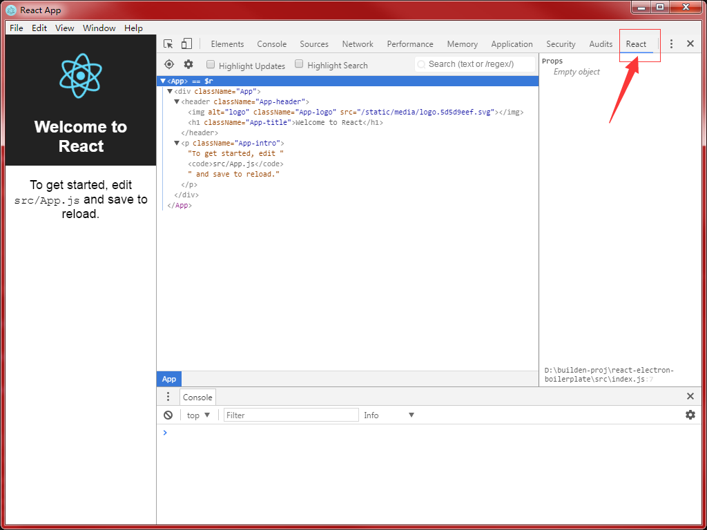

# 快速搭建Electron + React开发环境

## 1. 准备工作
1. 安装最新版的[node.js](https://nodejs.org/en/)
2. 安装依赖库
```bash
# 包管理工具 (推荐)
npm i -g yarn

# 包源管理工具 (推荐) 在国内建议切换到taobao源
npm i -g yrm
yrm use taobao

# react项目脚手架
npm i -g create-react-app
```
3. 设置环境变量
```bash
# 使用taobao的Electron镜像，可极大提高eletron包的下载速度
ELECTRON_MIRROR
https://npm.taobao.org/mirrors/electron/
```

## 2. 基础框架搭建
1. 创建项目
```bash
# 使用create-react-app创建项目
create-react-app react-electron-boilerplate

# 定位到react-eletron-boilerplate
cd react-electron-boilerplate

# 安装eletron依赖包
yarn add electron -D

# 安装包生成工具
yarn add electron-builder -D

# 跨平台项目环境变量设置依赖库
yarn add cross-env -D
```
2. 在项目根目录增加eletron的启动文件`main.js`
```js
const url = require('url');
const path = require('path');
const electron = require('electron');
// Module to control application life.
const app = electron.app;
// Module to create native browser window.
const BrowserWindow = electron.BrowserWindow;

// Keep a global reference of the window object, if you don't, the window will
// be closed automatically when the JavaScript object is garbage collected.
let mainWindow;

function createWindow() {
  // Create the browser window.
  mainWindow = new BrowserWindow({ width: 1024, height: 768 });

  mainWindow.webContents.on('dom-ready', () => {
    mainWindow.show();
  });

  // and load the index.html of the app.
  let startUrl =
    process.env.ELECTRON_START_URL ||
    url.format({
      pathname: path.join(__dirname, './build/index.html'),
      protocol: 'file:',
      slashes: true,
    });
  mainWindow.loadURL(startUrl);

  // Open the DevTools.
  mainWindow.webContents.openDevTools();

  // Emitted when the window is closed.
  mainWindow.on('closed', () => {
    // Dereference the window object, usually you would store windows
    // in an array if your app supports multi windows, this is the time
    // when you should delete the corresponding element.
    mainWindow = null;
  });
}

// This method will be called when Electron has finished
// initialization and is ready to create browser windows.
// Some APIs can only be used after this event occurs.
app.on('ready', createWindow);

// Quit when all windows are closed.
app.on('window-all-closed', () => {
  // On OS X it is common for applications and their menu bar
  // to stay active until the user quits explicitly with Cmd + Q
  if (process.platform !== 'darwin') {
    app.quit();
  }
});

app.on('activate', () => {
  // On OS X it's common to re-create a window in the app when the
  // dock icon is clicked and there are no other windows open.
  if (mainWindow === null) {
    createWindow();
  }
});

// In this file you can include the rest of your app's specific main process
// code. You can also put them in separate files and require them here.
```
3. 更新`package.json`
```json
{
  "main": "main.js",
  "scripts" {
    // ...
    "electron": "electron .",
    "electron:dev": "cross-env ELECTRON_START_URL=http://localhost:3000 electron .",
    "dist": "electron-builder",
    "dist:win64": "electron-builder --win --x64"
  },
  "homepage": "./"
}
```
4. 启动测试
```bash
# 方式1：可动态监视文件变化，有更新时会自动刷新页面，开发时推荐使用
yarn start
yarn electron:dev

# 方式2：模拟安装包安装后的环境，注意，这种方式不会自动刷新
yarn build
yarn electron
```
5. 生成安装包
根据`package.json` -> `scripts`中定义的命令
```bash
# 生成全平台的包
yarn dist

# 生成windows平台64位包
yarn dist:win64
```

## 3. 在browser代码中访问`electron`模块
> 注意：使用了electron模块，页面将无法在浏览器中运行，只能在eletron容器中运行
### 方案1：使用`react-app-rewired`修改webpack中的默认配置 (推荐)
1. 安装依赖库
```bash
yarn add react-app-rewired -D
```
2. 在项目根目录增加`config-overrides.js`
```js
module.exports = function override(config, env) {
  config.target = 'electron-renderer';
  return config;
};
```
3. 修改`package.json` -> `scripts`
```json
{
  "scripts": {
    "start": "react-app-rewired start",
    "build": "react-app-rewired build",
    "test": "react-app-rewired test --env=jsdom",
    // ...
  }
}
```

### 方案2：执行`yarn eject`，然后手动修改webpack的配置文件
* 这个方案的弊端就是create-react-app更新后不好同步更新

### 在Browser中使用`electron`模块示例
1. 使用electron的菜单
```js
import { remote } from 'electron';
const { Menu, getCurrentWindow } = remote;

class App extends Component {
  showMenu = () => {
    const template = [{ label: 'Menu1', click: () => alert('click menu') }];
    const menu = Menu.buildFromTemplate(template);
    menu.popup(getCurrentWindow());
  };

  // ...
}
```

2. 使用io操作，如文件系统
```js
import { remote } from 'electron';
const fs = remote.require('fs');
```

## 4. 高阶用法
### 4.1. 安装`react-developer-tools`chrome插件，便于调试
1. 安装`Electron插件安装器`，
```bash
yarn add electron-devtools-installer -D
```
2. 增加函数installReactDeveloperTools，并确保函数是在BrowserWindow对象创建之后调用
```js
function installReactDeveloperTools() {
  if (process.env.ELECTRON_START_URL) {
    const { default: installExtension, REACT_DEVELOPER_TOOLS } = require('electron-devtools-installer');

    installExtension(REACT_DEVELOPER_TOOLS)
      .then(name => console.log(`Added Extension:  ${name}`))
      .catch(err => console.log('An error occurred: ', err));
  }
}

function createWindow() {
  // Create the browser window.
  mainWindow = new BrowserWindow({ width: 1024, height: 768 });

  installReactDeveloperTools();

  // ...
}
```
3. 上面示例代码只会在执行`yarn electron:dev`的时候运行，如果第一次在`Chrome Deveplorer Tools`中没看到React标签，请重新执行`yarn electron:dev`，成功后如图所示


### 4.2. 支持ES7`Decorator`语法，如果你和我一样中意`mobx`状态管理库，这个功能就必不可少了
1. 安装依赖包
```bash
# babel的decorator转换插件
yarn add babel-plugin-transform-decorators-legacy -D

# mobx
yarn add mobx mobx-react -D
```
2. 修改`config-overrides.js`，让babel加载decorator插件
```js
const { injectBabelPlugin } = require('react-app-rewired');

module.exports = function override(config, env) {
  config.target = 'electron-renderer';

  config = injectBabelPlugin('transform-decorators-legacy', config);

  return config;
};
```
3. 如果使用的是vscode编辑器，默认语法静态检测会认为`@decorator`是异常代码，在根目录增加`jsconfig.json`
```json
{
  "compilerOptions": {
    "experimentalDecorators": true
  }
}
```

### 4.3. 安装包定制
#### 4.3.1. 修改程序默认图标
1. electron-builder图标默认存放在build目录，由于这个目录被create-react-app默认用于存放webpack打包后的目录，所以我们在`package.json`中改一下electron-builder的配置
```json
{
  "build": {
    "directories": {
      "buildResources": "build-res"
    }
  }
}
```
2. 把icon图标存入`build-res`目录，[icon图标文件名，格式等](https://www.electron.build/icons)

#### 4.3.2 只打包依赖的文件，缩减安装包尺寸，同样是修改electron-builder的配置
```json
{
  "build": {
    "files": ["main.js", "build/**", "!build/**/*.map"],
    // ...
  }
}
```

## 参考
* [yarn](https://yarnpkg.com)
* [create-react-app](https://github.com/facebookincubator/create-react-app)
* [electron](https://electron.atom.io/)
* [electron-builder](https://github.com/electron-userland/electron-builder)
* [react-app-rewired](https://github.com/timarney/react-app-rewired)
* [mobx](https://mobx.js.org/)